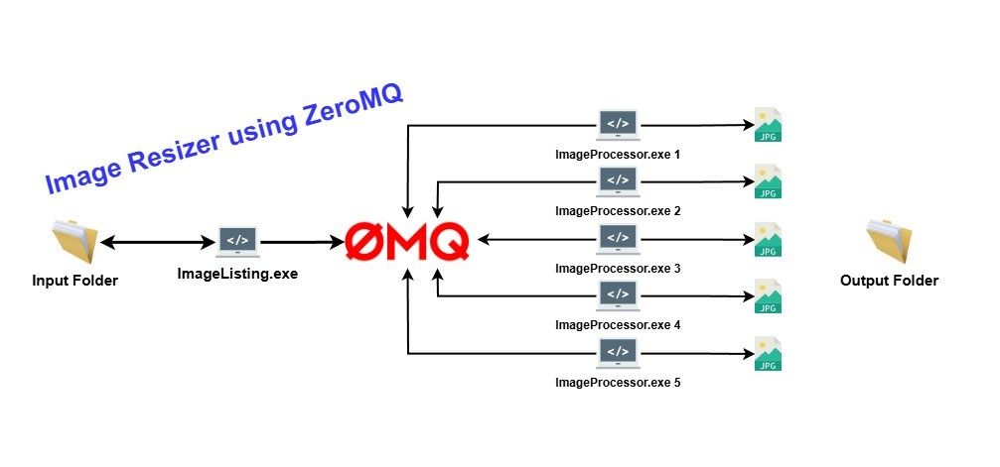

# ImageProcessor


This repo contains projects which implement the pub / sub pattern to resize images.

## Implementation
Implemented with 
1. C#
2. [ZeroMQ](https://zeromq.org/) - [NetMQ](https://github.com/zeromq/netmq)
3. [SixLabors/ImageSharp](https://github.com/SixLabors/ImageSharp)

## Execution
```
@echo off

start ImageListing\bin\Release\net8.0\ImageListing.exe "C:\Users\omo\Pictures\2025-04-19-football" "C:\Users\omo\Pictures\2025-04-19-football-out" 20
start ImageProcessor\bin\Release\net8.0\ImageProcessor.exe 1
start ImageProcessor\bin\Release\net8.0\ImageProcessor.exe 2
start ImageProcessor\bin\Release\net8.0\ImageProcessor.exe 3
start ImageProcessor\bin\Release\net8.0\ImageProcessor.exe 4
```

